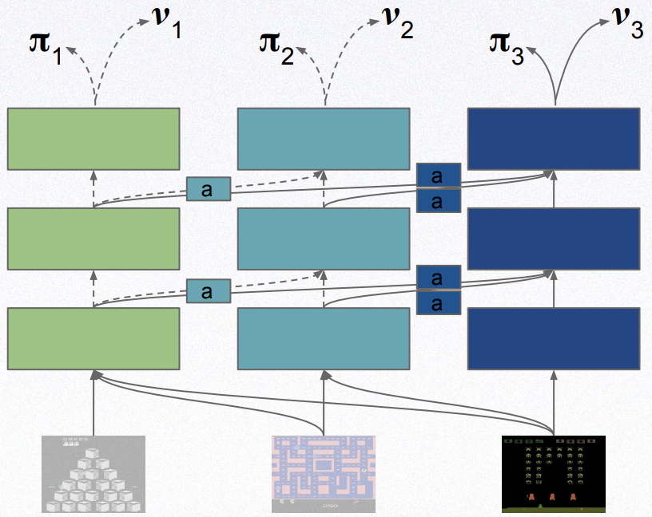

# [ Progressive Neural Networks](https://arxiv.org/abs/1606.04671)

##### TLDR

Additional article – [Sim-to-Real Robot Learning from Pixels with Progressive Nets](https://arxiv.org/abs/1610.04286)

Presentation – https://www.youtube.com/watch?v=aWAP_CWEtSI

Slides – http://juxi.net/workshop/deep-learning-rss-2016/slides/Raia_Hadsell_RSS_DL_workshop.pdf

Idea:

Intuition:

We have some trained network for task 1 – "column 1". And we want to transfer it knowlenge to new task. Rather than finetine column 1, let's froze it and make a new clean copy of it – column 2. Then just train the column 2 for new task, BUT with adding inner features from column 1.

Results:

Additionally, we can analyse what blocks are used with different setups of knowledge transferring.

