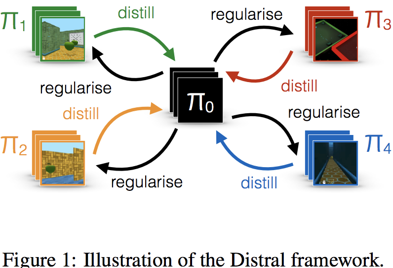
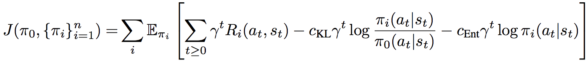

# [Distral: Robust Multitask Reinforcement Learning](https://arxiv.org/abs/1707.04175)

##### TLDR

Presenataion – https://www.youtube.com/watch?v=scf7Przmh7c

###### How it looks:

###### Objectvive:

###### Intuition:
We try to learn one common policy for several different levels of the game (simulation, etc). So we add additional regularization term (cKL) to get our level-policy close to common one. (Similar idea to PPO one?)