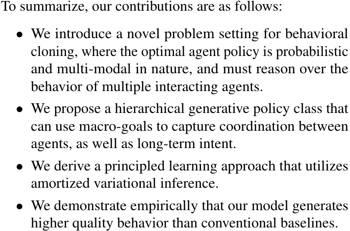
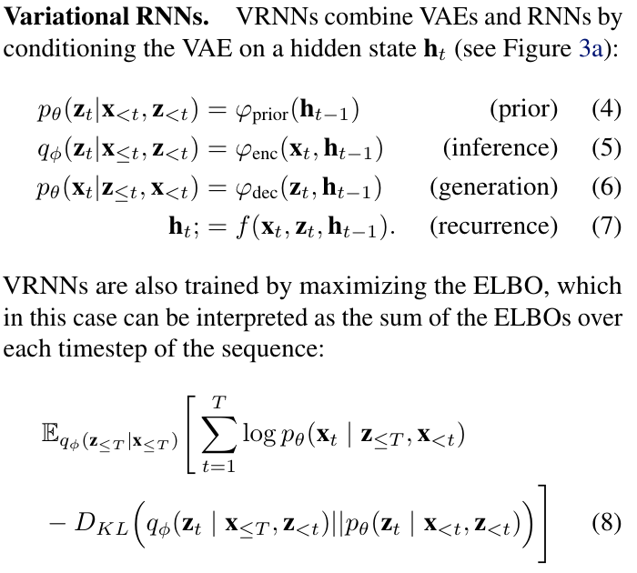
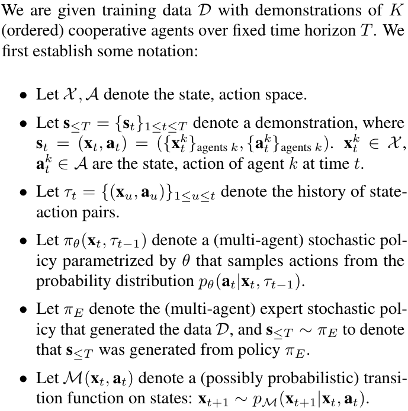
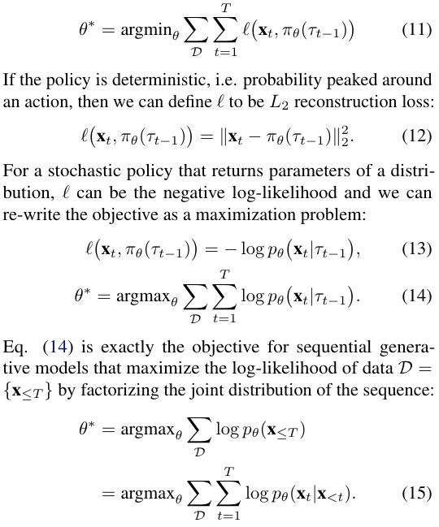
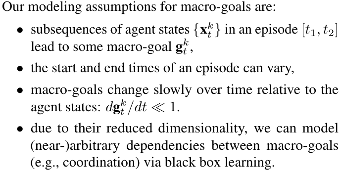
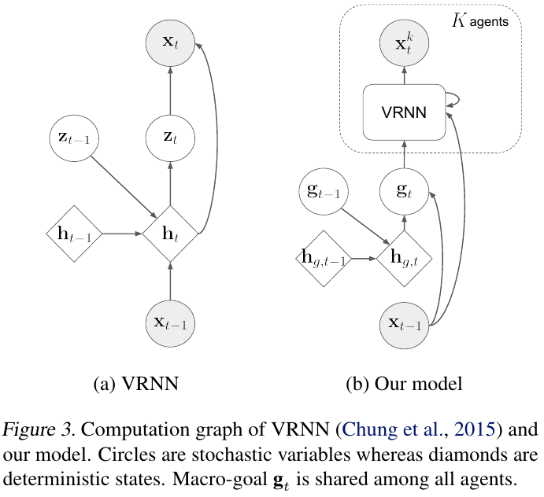
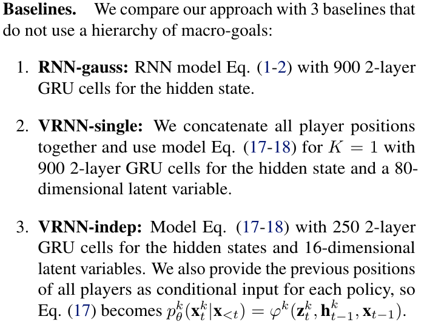
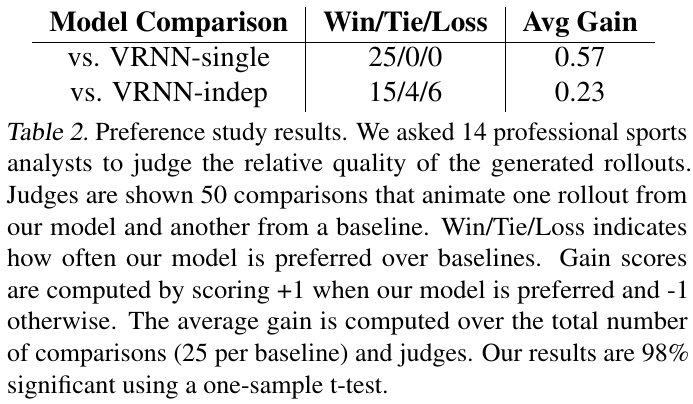
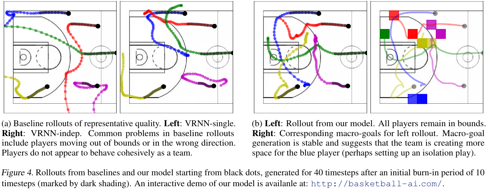
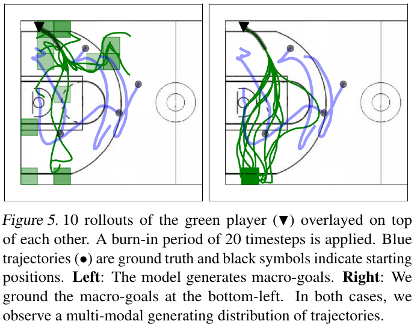

# [Generative Multi-Agent Behavioral Cloning](https://arxiv.org/abs/1803.07612)

##### TLDR [Imitation Learning]

Sometimes, all we have is pre-collected demonstration data, from which we should learn an optimal policy. Nevertheless, all can go wrong as we want our agent to be creative. All become even more complex if we have a lot of agents and each of them should communicate with each other. To solve all these problems authors suggest usage of combination of VRNN (RNN with VAE)  with additional goal-oriented RNN.

- article with [source code](https://github.com/ezhan94/gen-MA-BC) and [demo](http://basketball-ai.com)

##### Notes

###### Generative multi-agent behavioral cloning

- *simplest* form of imitation learning	
- desired policy does not necessarily perfectly mimic the demonstrations, but rather recover the generating distribution from which the demonstrations were sampled
- we also need our agent to behave coherently over long time horizons
- multimodal agents

###### *VRNNs

###### Notation

###### Learning Objective

Because of the problem formulation, we can use several tricks - insted of action prediction, we can predict next state or probability of the next state.

And with respect to multi-agent:

###### Model

Additional assumption - macro-goals.
- provide tractable way to capture coordination between agents
- encode long-tern intents of agent and enable long-term planning at a higher-level timescale.

###### Experiments & Results

Baselines

Comparison

Cooperation

Multimodal behavior

##### Afterworlds

- The ball is a lie
- As for me, setup with RNN over VRNN looks too complex
- What about CNN/TCN/Attention-like and GAN usage instead of RNNs for generation?
- Wonder to see this approach for music creation (instruments as a agents)
- Can this approach be applied for coninuous action space environments? (For these problem I see only finite number of states and goals.)

##### Interesting links

1. [A Recurrent Latent Variable Model for Sequential Data](https://arxiv.org/abs/1506.02216)

Review (in russian): https://youtu.be/L0vM1Z0YL5g