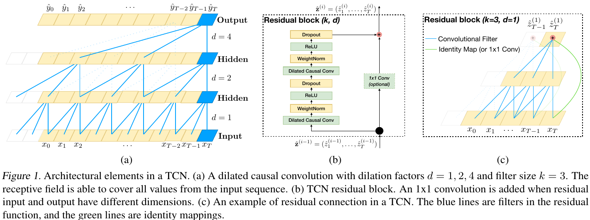
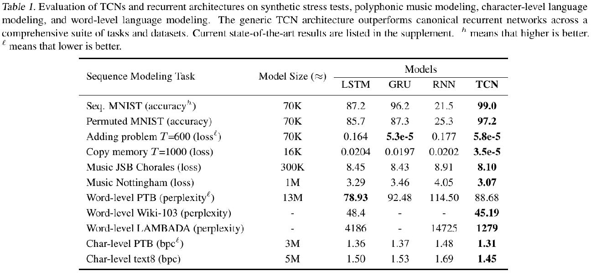
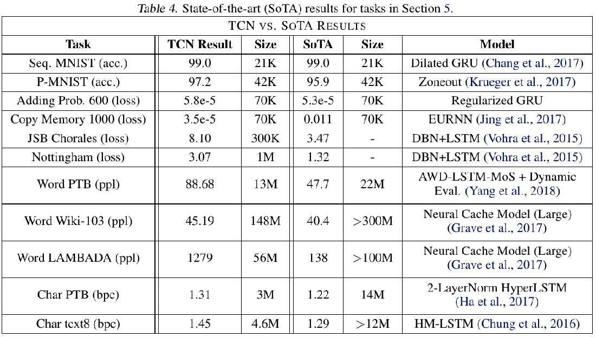
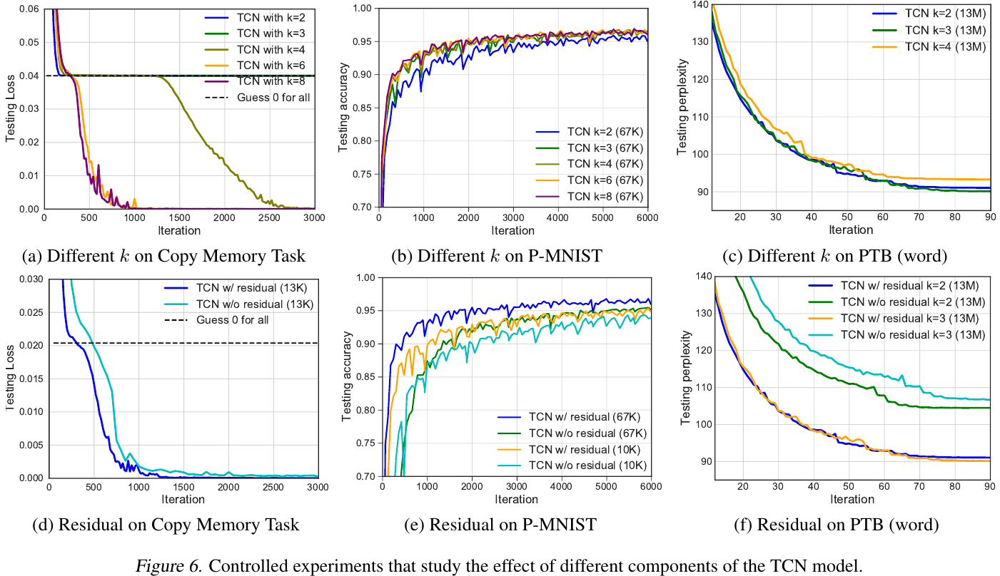
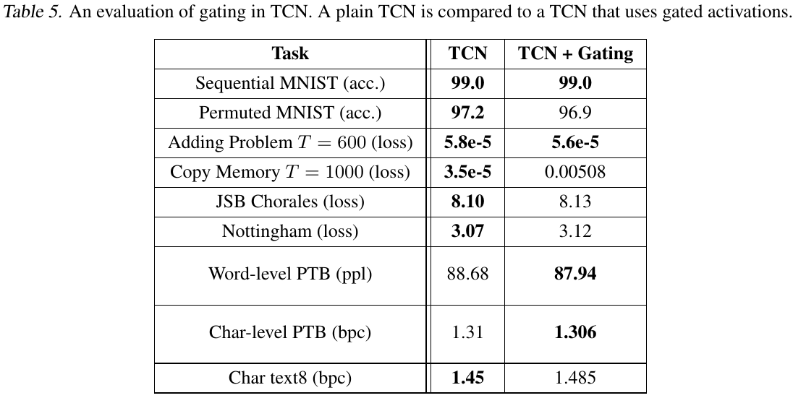

# [An Empirical Evaluation of Generic Convolutional and Recurrent Networks for Sequence Modeling](https://arxiv.org/abs/1803.01271)

##### TLDR

As we know, RNNs are commonly used for sequential data modeling in the DL field. Baseline LSTM-like architectures were the most standard approach for this task. Nevertheless, time goes fast and nowadays we see a lot of experiments with CNN and Attention models for sequential data processing. With this idea, authors present their study of systematic comparison between CNNs (more concrete, TCNs - Temporal Convolutional Networks) and RNNs architectures of the variety of tasks.

- appendix with all interesting stuff and hyperparameters
- article with [source code](https://github.com/locuslab/TCN) - great! Pytorch - great x2! clear code implementation - great x200!
- article of the 1st-year PhD student - really cool achievement (article, appendix, code - all best practices for DL research, as for me)

##### Notes

After LSTM comes out, there was only a few significant improvements in applying RNNs for sequence modeling. So, DL community start to combine CNNs and RNNs architectures: Quasi-RNN, Dilated RNN. Nevertheless, CNN-only approach was not fully investigated.

Intro to [TCNs](https://arxiv.org/abs/1611.05267):
- the convolutions in the architecture are causal, meaning that there is no information “leakage” from future to past
- the architecture can take a sequence of any length and map it to an output sequence of the same length, just as with an RNN.
- much simpler than WaveNet (no skip connections across layers, conditioning, context stacking, or gated activations)

Advantages:

- parallelism
- flexible receptive field size

- stable gradients
- low memory requirement for training
- variable length inputs

Disadvantages:

- data storage during evaluation (production)
- potential parameter change for a transfer of domain (as for me, RNNs still have such problems)

###### Comparison

Interesting fact - grid search was used to find good set of hyperparameters for recurrent models.

###### Improvements

##### Afterworlds

- if you know the length distribution of your data, it's time to try TCNs for your problem (as for me, pure dynamic lengths are almost never used in practical applications)
- It's interesting to see experiments with pretrained W2V for LM tasks
- Due to the TCNs advantages, they can be a real competitor for RNNs field tasks.

##### Interesting links

- [Temporal Convolutional Networks for Action Segmentation and Detection](https://arxiv.org/abs/1611.05267)
- [source code](https://github.com/locuslab/TCN)

