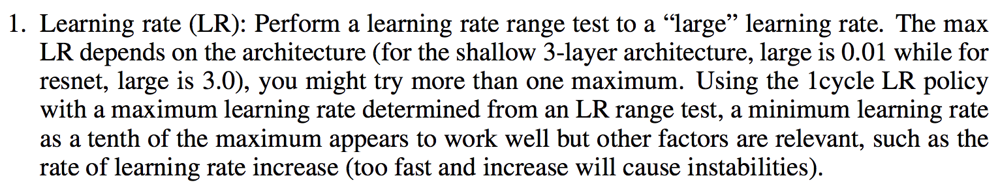
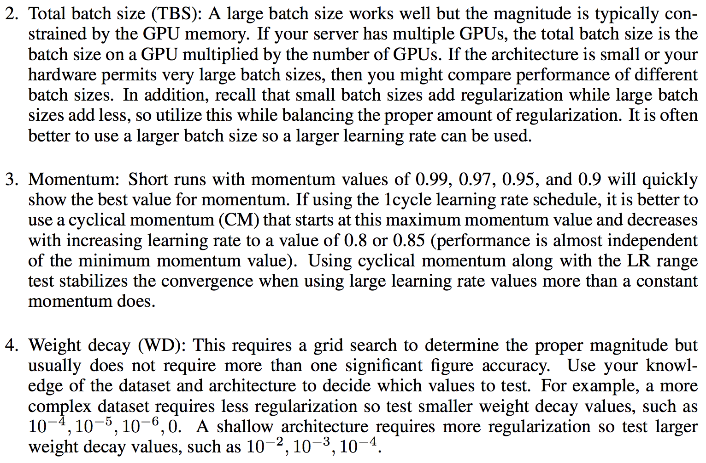

# [ A disciplined approach to neural network hyper-parameters: Part 1 -- learning rate, batch size, momentum, and weight decay](https://arxiv.org/abs/1803.09820)

##### TLDR

##### Interesting links

code - https://github.com/lnsmith54/hyperParam1