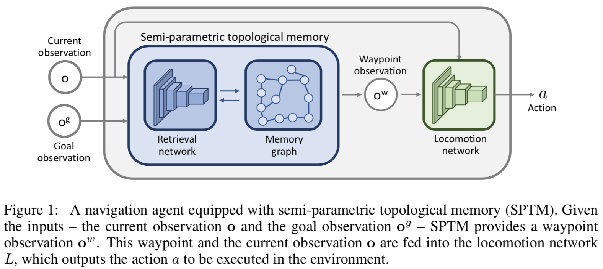
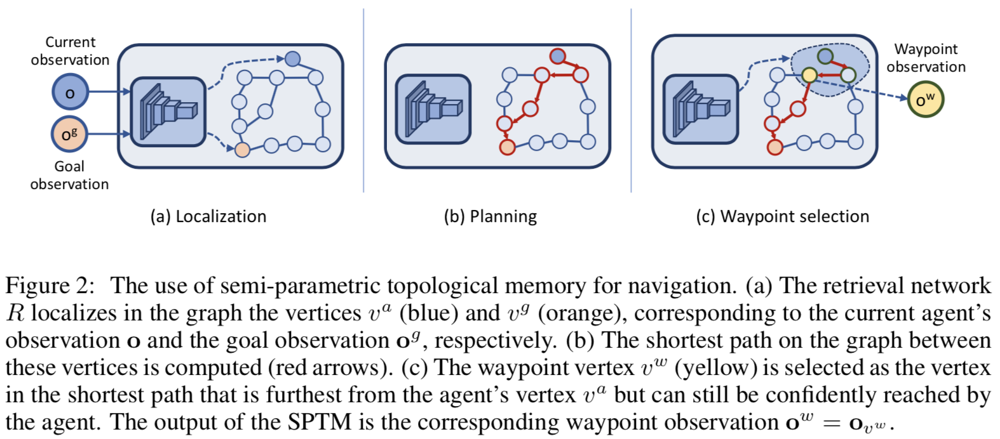
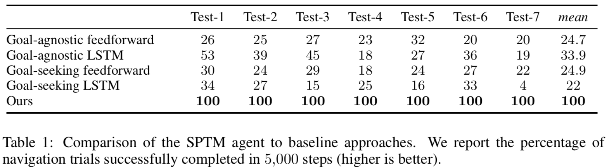

# [Semi-parametric Topological Memory for Navigation](https://arxiv.org/abs/1803.00653)

##### TLDR

Problem - navigation in novel unseen environments. Idea - let's build topological (not metric, as usual) map of the environment and use it to confidently navigate towards goals. Map graph builds upon trajectories from random agent walk. Inference and planning done by association current observation with graph vertex (knn approach), then - dijkstra algorithm to find path to goal vertex and finnaly - locomotion network to take an action to reach next subgoal (next closest to goal vertex by dijkstra).

- new approach, no grids, self-builded graphs - it's good
- graph basen on random agent - that bad (even authors write about it), nevertheless, it looks like only the first article of future research. So, maybe next year we will see better approaches for environment graph building.
- weak baseline, or not fully tuned (again, authors point it themselves).
- but still, the main idea is excellent!
- [project page](https://sites.google.com/view/SPTM)
- [source code](https://github.com/nsavinov/SPTM)

##### Notes

So, a bit more concrete:

1. Firstly, we send random agent to new environment to generate samples and trajectories. This proccess end by time limit or frame limit.
2. Then, with some heuristics and siamese netrorks we create our environment graph.
3. and build *Retrieval* network (to compare different observations and have an ability to quickly find current position in the graph).
4. After that, there is a phase of *Locomotion* network training, which uses collected sample and pseudo-goals to get some knowledge of how to navigate throught graph.
5. Now, all is done, we can do inference:
   1. from goal and current states *Retrieval* networks gives us graph vertices.
   2. then, dijkstra comes out and we plan our route and select next subgoal - waypoint state.
   3. finally, *Locomotion* networks tries to predict how to go to this waypoint state.

###### Comparison with RL baselines

Yeap, non-RL approach (all nets are trained semi-supervised) vs RL-approach.

##### Afterword

In the end, this is a new look at the problem of navigation, but something confuses me.

- what will be in case large environment?
- knn usege looks like a bit hack, as for me. 5 minutes of random agent was enouhgt to just overfit for every test environment. knn and dijkstra after that just give us typical graph search?

But, what is really cool is this approach of high level plaling with graph and dijkstra and local planning with *Locomotion*. Really interesting approach.

##### Interesting links

- [project page](https://sites.google.com/view/SPTM)
- [source code](https://github.com/nsavinov/SPTM)