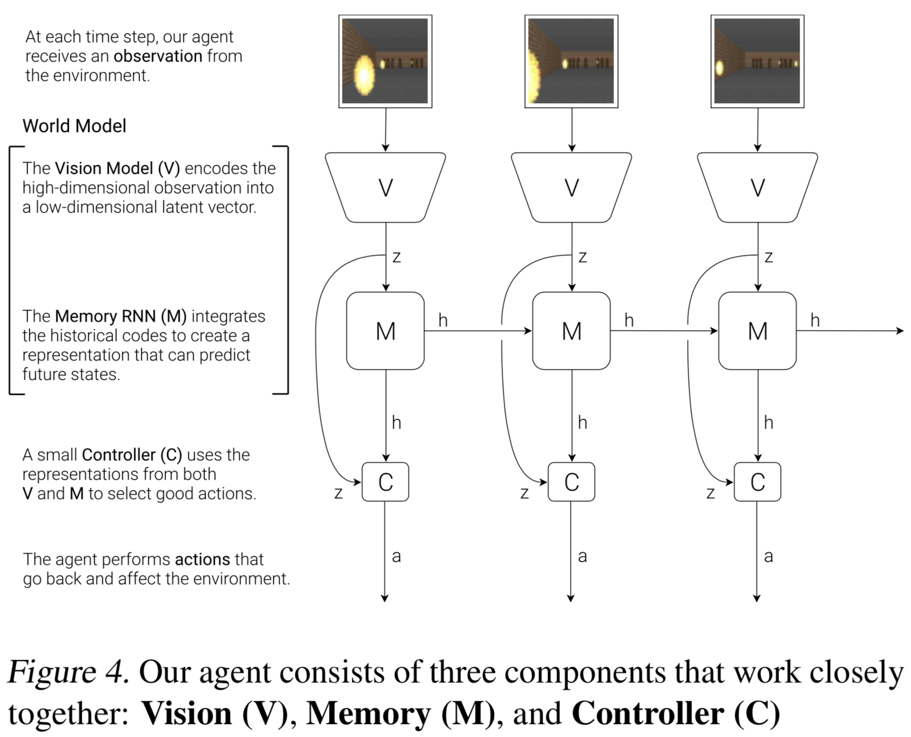
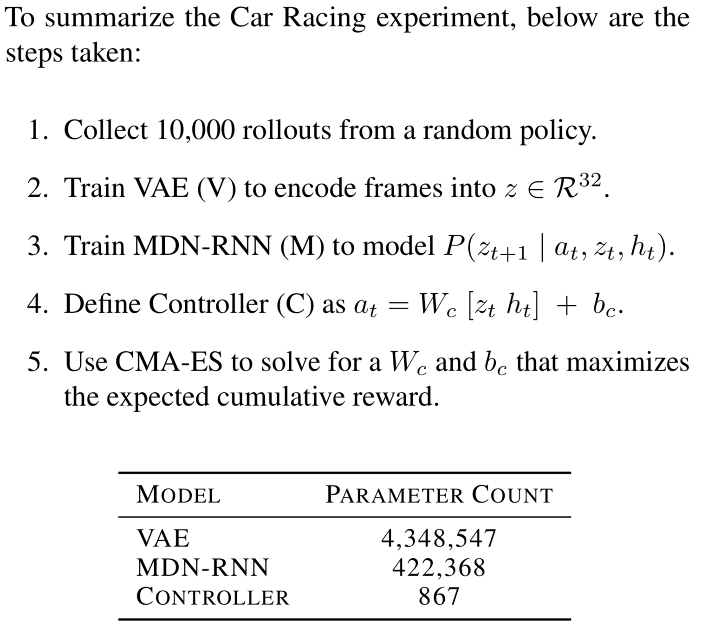
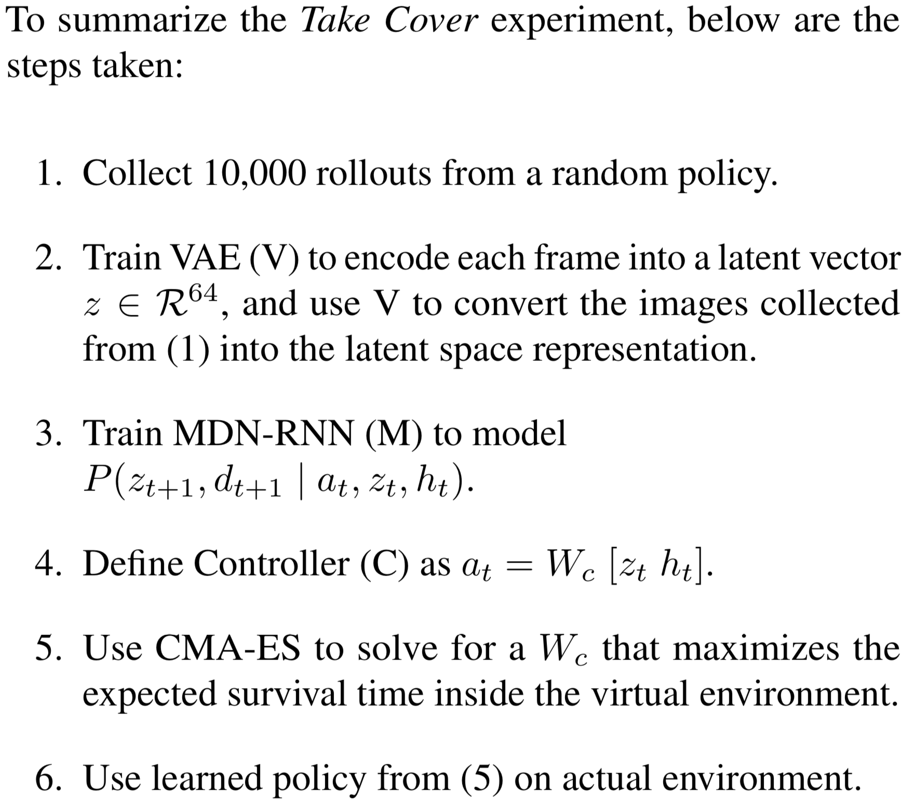
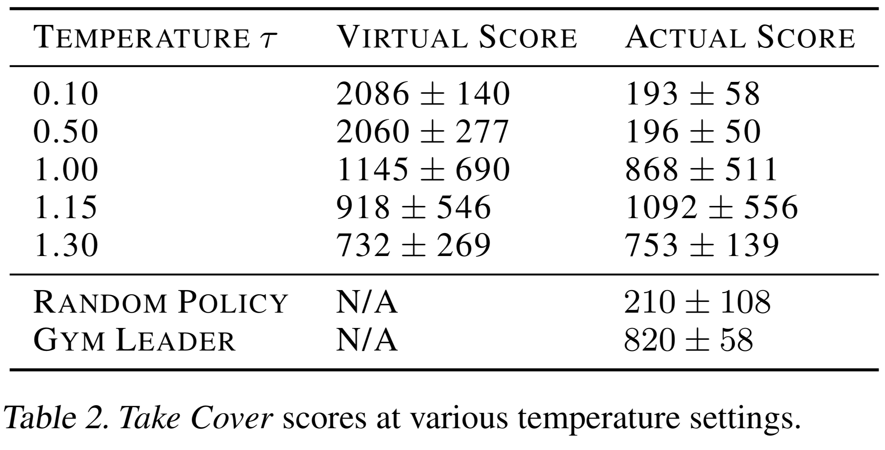

# [World Models](https://arxiv.org/abs/1803.10122)

##### TLDR

Really interesting view on Model-Based methods with logical model parting (world model, memory, controller).

- exiting demo, lots of ideas, many to think about.
- VAE for environment modelling - nice, waiting an opportynity to test this idea on sample unefficient env.
- RNN learned on latent representations - so we can sample environment trajectories in the noise
- quicke and simple controller for action selection

##### Notes

So, the idea behind the paper is qute simple (and I can say it have some inspiration from how human thinks). 

Firstly, let's look at learning environment representaitons from another point of view. It's common to encode observation with respect to action selection and reward maximization. But, we can simply learn compact state represenatation with AE, or as authors suggests VAE. By this way, we encode not only the information needed to action selection, we compress all the information from the original observation. So, using autoencoder process we can obtain **world model**.

Okay, we can encode each environment state into some compact representation. But what about transactions? In every environment there is some probabilities to come to statet+1 from statet. For this purpose **memory** model exists. Authors use RNN with mixture of gaussians to model P(zt+1| zt), where z - our encoded state from world model.

After that, we need only **contoller** model to select action from current zt.

A bit more about the models in the figures below.

All looks good, but we want something more. We want learning in the dreams and transter this knowledge to real-world (okey, real simulations). Can we do this? Yes, we can!

It was a bit cheating, authors use the environment, main goal of which - live as long as you can. By this way, they don't need to simulate reward function, only done one. Nevertheless, the pipeline looks very familiar to previous one.

Unfortunately, something can go wrong - agent can learn policy to cheat in the dream-enviromet, so we need to make it more stochastic and hardcore. And, it works:

 

By the way, all this 2 experiments beated the Gym leaderboard for this environments. So, take a look at the ideas.

##### Afterworlds

By reading this article I come to the idea: if we can simulation *done* for the environmet, can we also simulatio some advantage reward function? Something like,  the measure of usefulness of transition from one state to another?

As for me, it is quite interesting to see more and more approaches of transfering simulation-learned knowledge to real world.

##### Interesting links

Demo - [worldmodels.github.io](worldmodels.github.io/)