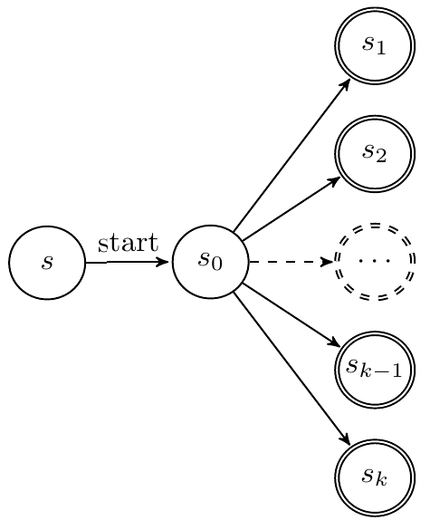
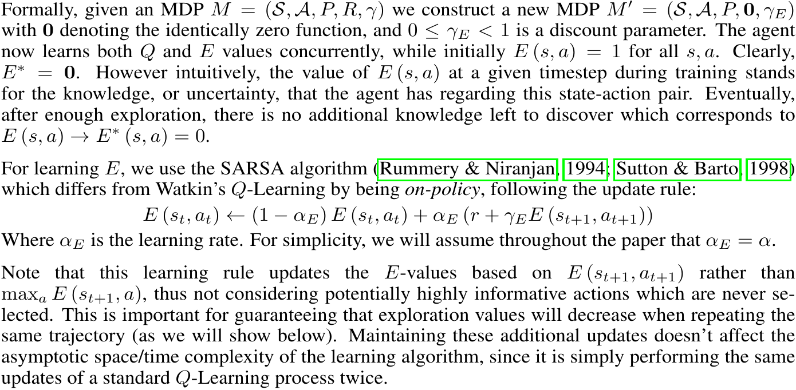
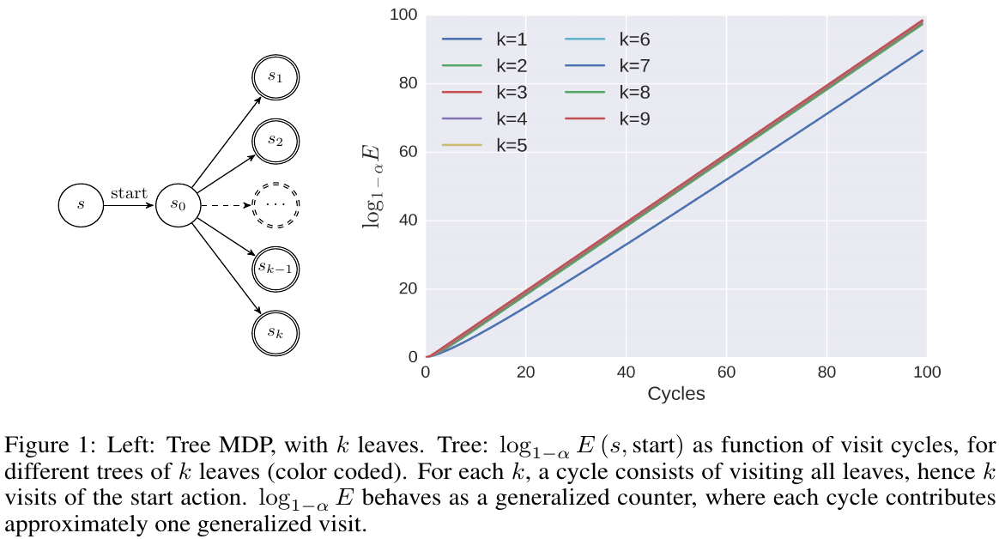
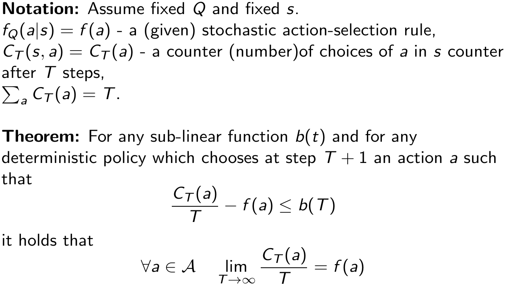
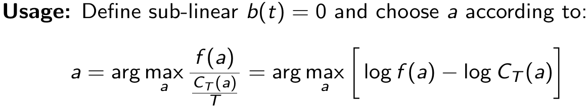
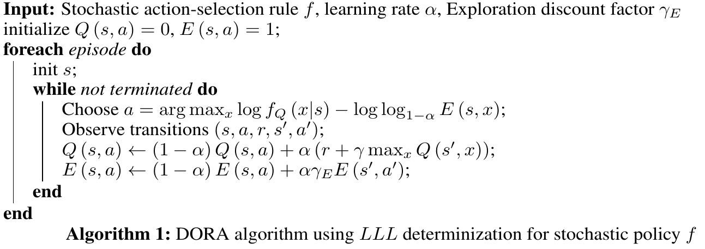
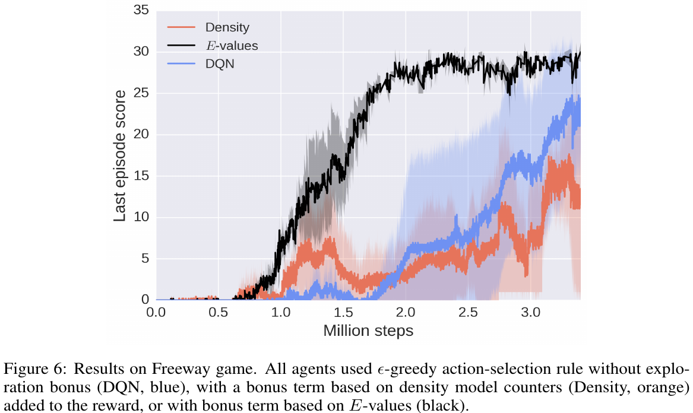

# [DORA The Explorer: Directed Outreaching Reinforcement Action-Selection](https://arxiv.org/abs/1804.04012)

##### TLDR - perfect article naming

When it comes to an exploration, it's common to use some additional heuristics as *counter*s in RL field. Nevertheless, there are number of disadvantages of simple "state" counters. So, the authors propose E-values, a generalization of counters over state-action trajectories. The idea looks quite interesting and can be applied to continuous MDPs.

- again, a lot of detail in appendix
- tricky theory
- only 2 practice results: MountainCar and Freeway

##### Notes

Basic intuition behind the counters: for each state in our MDP let's define an additional *parameter* - counter C*s*. When our agent comes to state *s* , let's increment  C*s* counter. Returning to the exploration - we assume, that less visited states (with low C*s* values) are more interesting for us for exploration purpose.

So, what can go wrong? Let's check an example:

Here we can see some intermediate "parent"-state *s0* with *k* "child"-states. So, the problem: we can visit "parent"-state *s0* a lot of time, but don't visit all its *k* "child"-states. And from some  "preparent"-state *s* , state *s0* looks like high explored, but it's completely wrong.

---

So, can we do better? 

Looks like yes. Let's look at exploration from a "reward" point of view. For each state-action pair we can define a function *E(st, at)* that will define some kind of exploration rate for this state-action pair. As reward we can approximate this E function with discount factor and SARSA algorithm. Long story short, shortcut from article with main idea:

How can it help?

Here we assume, that *gammaE* = 0,  so *E(s, a) = (1 - alpha)n *, so *n = log1 - alphaE(s, a)*. As we can see, the parent counter for state *s* increases monotonously with number of cycles (visiting all *k* "child"-states).

After that, authors propose the logarithm of *E*-values as a generalization of counters and replace the standard counter with its corresponding generalized counter (log1 - alphaE).

---

How to apply?

It's a bit tricky, but we use some additional assumptions.

Now, main algorithm looks quite simple:

---

But where are neural nets and all kinds of approximations? Finally, a bit of MountainCar (appendix only) and Freeway experiments.

##### Afterworlds

The idea look really interesting and reasonable for *finite* MDPs but...

- Interesting to see an Figure 1 example where cycle consists of visiting **not** all leaves.
- Not much info about approximation practice and neural network usage for continuous MDPs. As for me, it's the most interesting part.

##### Interesting links

1. Marc G. Bellemare, Sriram Srinivasan, Georg Ostrovski, Tom Schaul, David Saxton, Remi Munos. [Unifying Count-Based Exploration and Intrinsic Motivation](https://arxiv.org/abs/1606.01868)