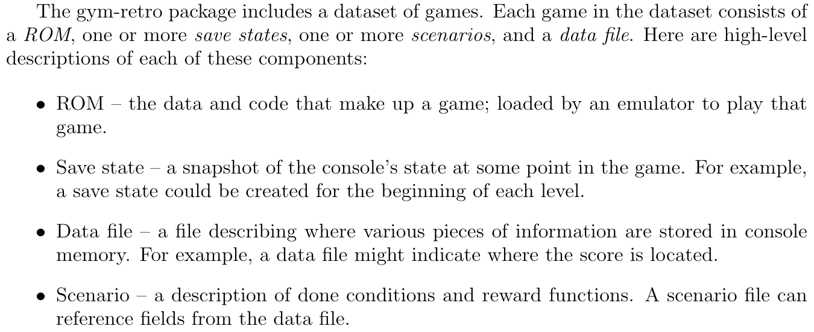
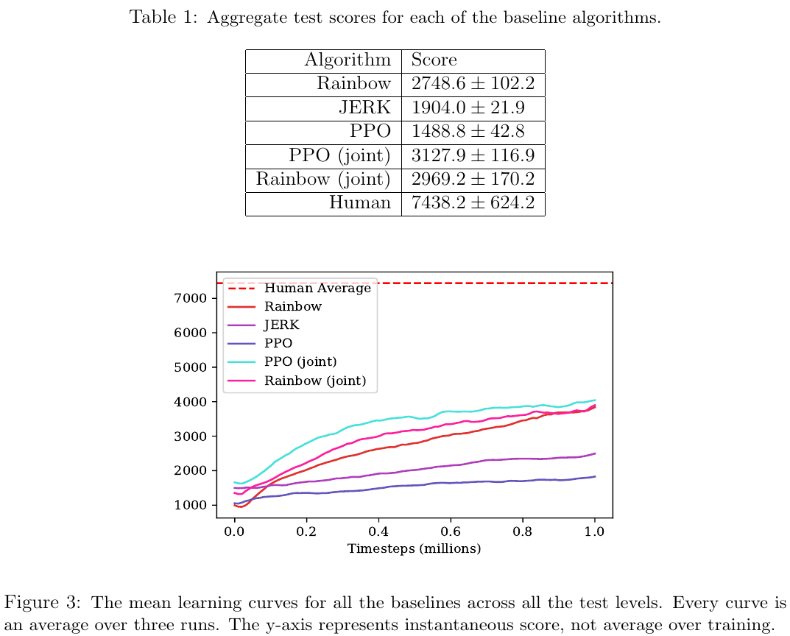

# [Gotta Learn Fast: A New Benchmark for Generalization in RL](https://arxiv.org/abs/1804.03720)

##### TLDR

Why are we so in love with RL? Cause we can train on the test set, of course. But, these time are over. OpenAI researcher decide to create a typical benchmark environment with train/test.... levels of Sonic game. Baselines included.

- new cool environment - competitive, needs agent's level memorization 
- finally, we have train/test split in RL (mixed feelings still)
- appendix included

##### Notes

###### Environment

So, a bit more about new environment.

Typical trick like random frame skip were also used.

###### Baselines

Additionally, authors present several baselines:
 - human with 2h pretrain
 - PPO
 - Rainbow (DQN)
 - JERK (greedy algorithm)

###### Whats the point

So, why it's do good?

- Firstly, we have new RL environment, that is much different from the others. For this one, we need to create RL algorithms with new type of memorization techniques and planning.
- Secondly, we have open sourced baselines. As for me, the code it not wery used-friendly, nevertheless, you can read it and get the main ideas for your own trials.
- Lastly, we have a competition (contest) - new OpeAI challenge for RL researches to solve this environment.

##### Afterworlds

- ​No time for questions - it's time to solve the contest.

##### Interesting links

Retro contest - https://contest.openai.com.

1. [Progressive Neural Networks](https://arxiv.org/abs/1606.04671)
1. [PathNet: Evolution Channels Gradient Descent in Super Neural Networks](https://arxiv.org/abs/1701.08734)