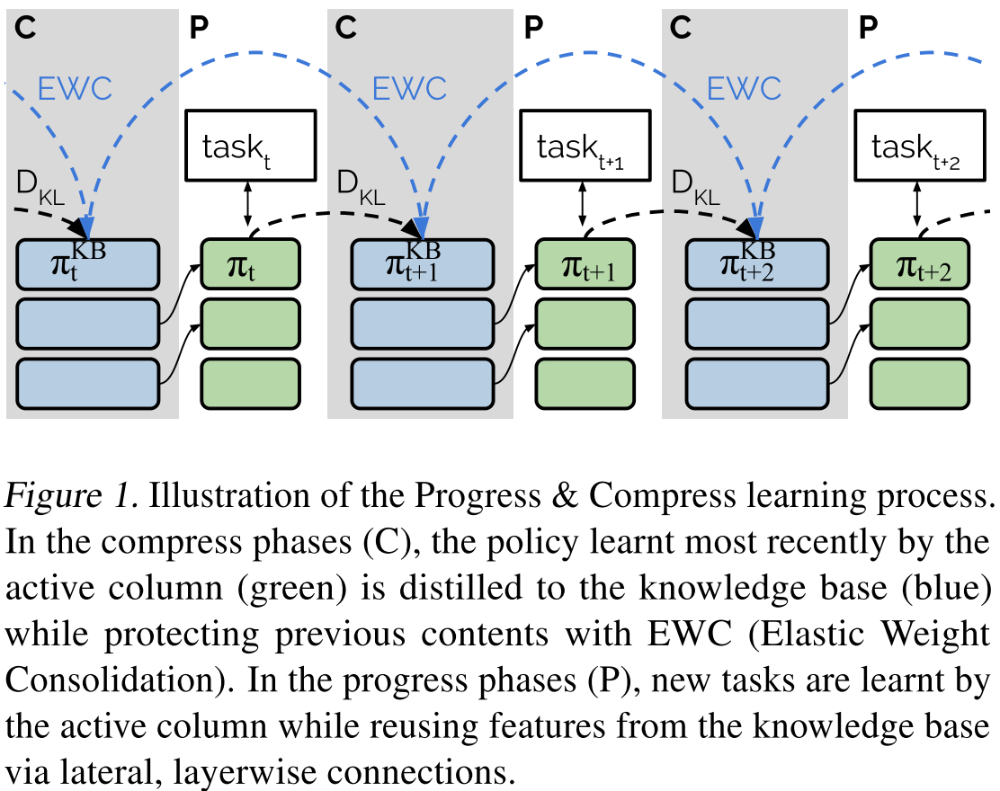
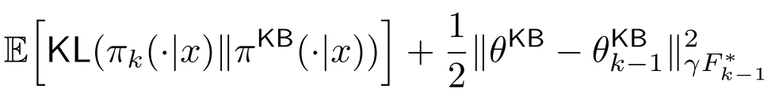
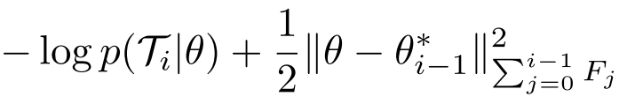
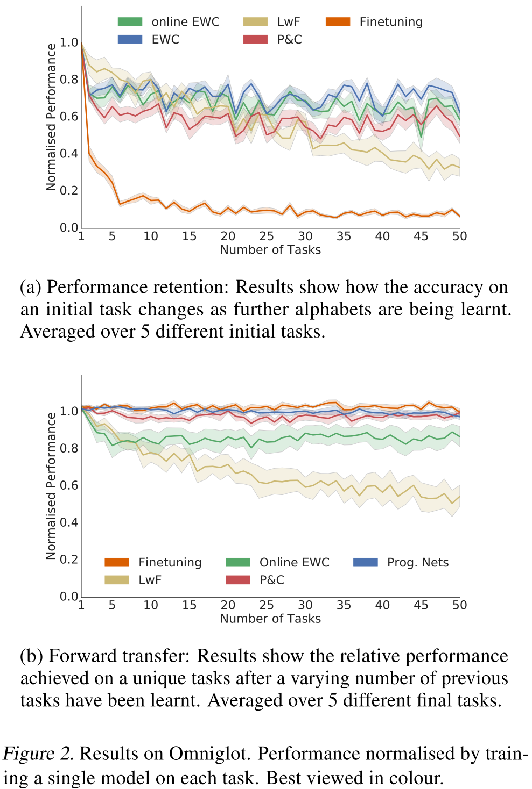
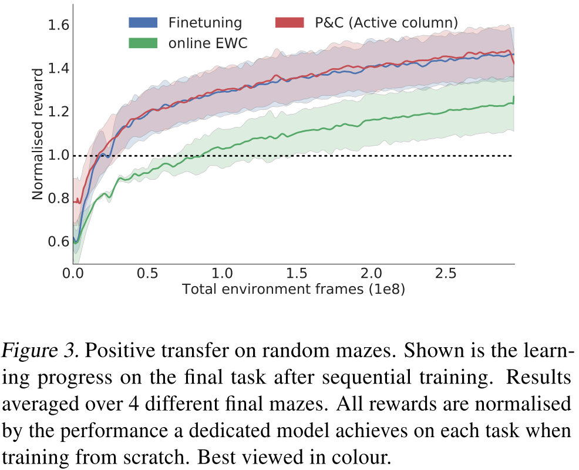
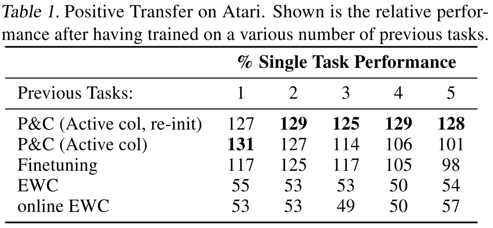
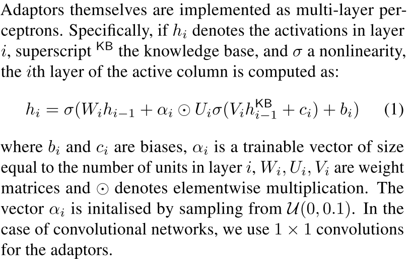

# [ Progress & Compress: A scalable framework for continual learning](https://arxiv.org/abs/1805.06370)

##### TLDR

Idea:

Updated version of progressive networks. Rather than every time add new column, let's reformulate task and have only one knowledge column and tine task-specific columns (progress phase) to refresh parameters of th eknowledge one (compress phase).

Compress phase objective:

Progress pahse objective:

Results:

Progressive net addition, a bit about adaptors:

##### Interesting links

1. [Hybrid computing using a neural network with dynamic external memory](https://www.nature.com/articles/nature20101)
2. [On quadratic penalties in elastic weight consolidation](https://arxiv.org/abs/1712.03847?context=cs)
3. [Overcoming catastrophic forgetting in neural networks](https://arxiv.org/abs/1612.00796) (EWC)