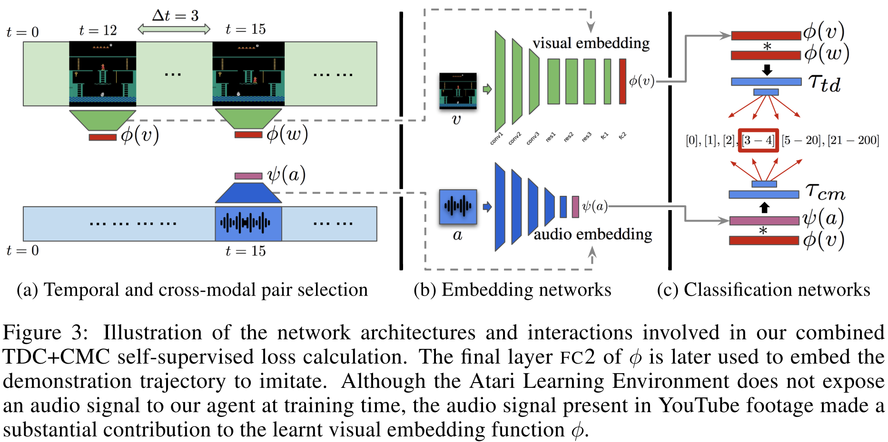
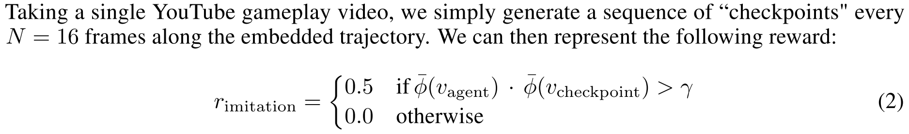
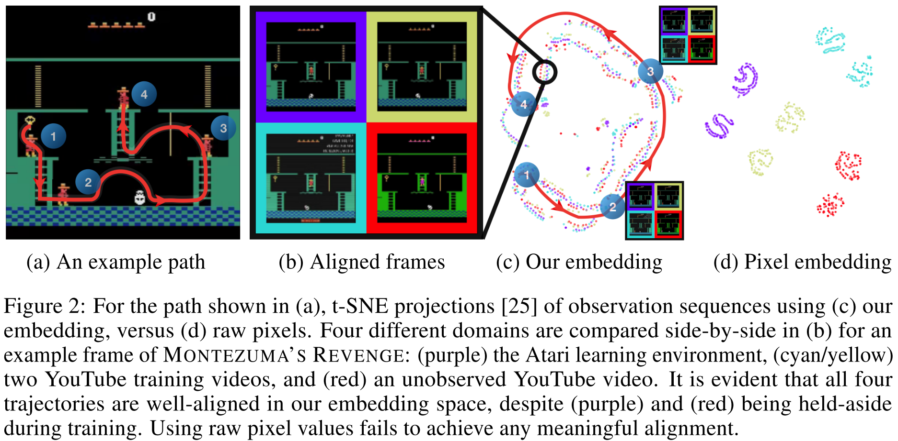
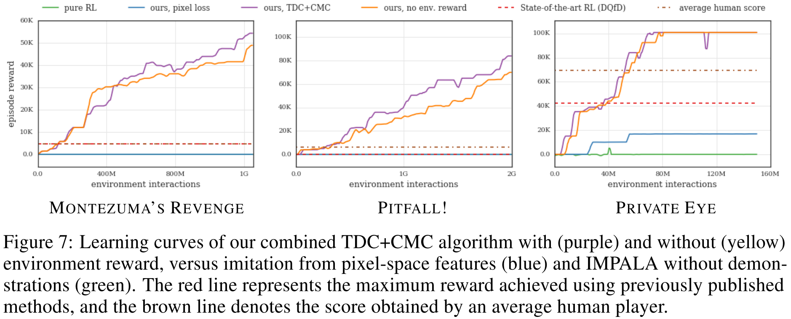

# [Playing hard exploration games by watching YouTube](https://arxiv.org/abs/1805.11592)

##### TLDR

###### Idea:

Hard exploration games are...complicated. But if humans can learn how to pass them, so can agents too. Main question is "how to prepare the available data for learning?".

Firsly, encode all the available replays to predict the distance between two different frames. (Authors use classification, by can we do it with metric learning?) By this way we can achieve a good representaitons of the frames. 

Secondly, you can learn to imitate the replays with simple reward function like:

So, it looks something like this.

That it. (But, it is not so simple.)

###### Results:

